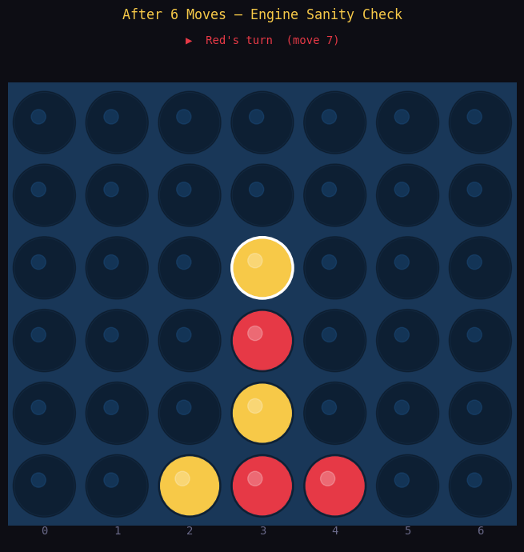
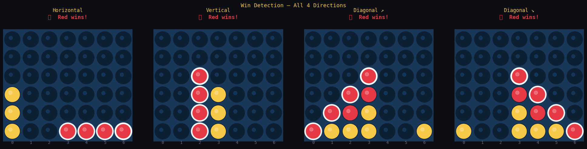
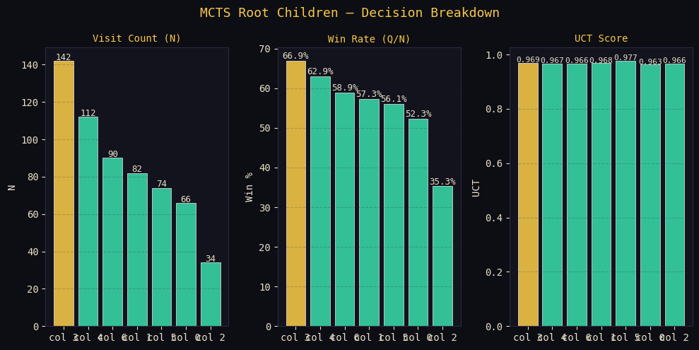
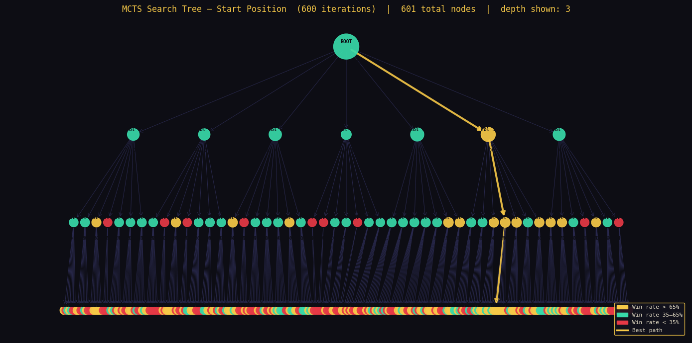
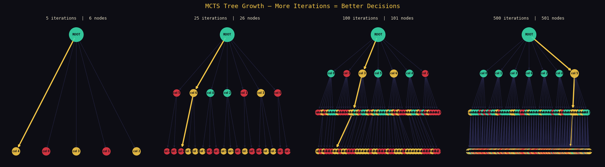
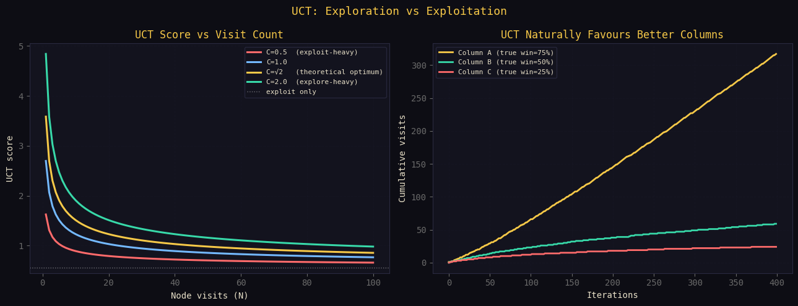
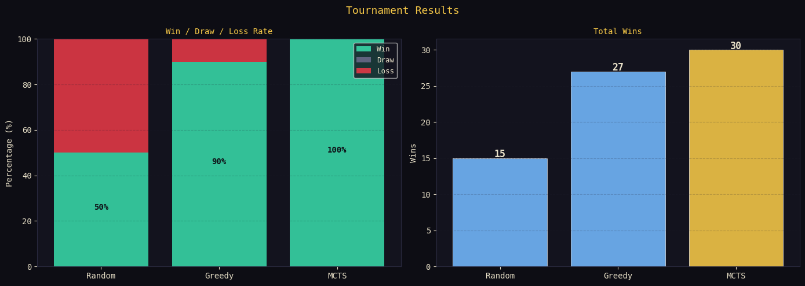
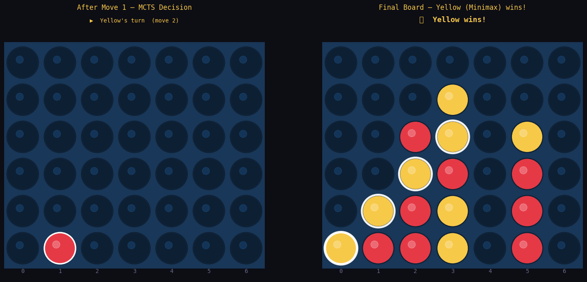
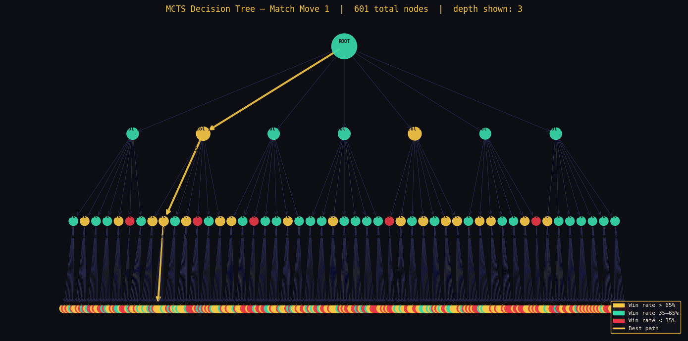
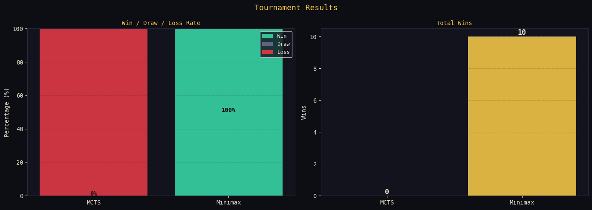

# Foundations of Adversarial Search
### From Minimax to Monte Carlo Tree Search

**Connect Four — AI Implementation & Analysis**

Connect Four is a two-player strategy game where the goal is to connect 
four pieces in a row — horizontally, vertically, or diagonally — before 
your opponent does. Simple rules, but the decision space has over 10¹³ 
possible states, making it a perfect testbed for adversarial AI.

This project implements two fundamentally different AI approaches to the 
same problem: Minimax, a classical algorithm from 1928 that exhaustively 
searches the game tree, and Monte Carlo Tree Search (MCTS), a modern 
statistical method from 2006 that learns purely from random simulations 
with no human-written heuristics. Both agents are built from scratch and 
compete live in a pygame arena, with full analysis of their performance.

---

## Repository Structure

```
MCTS/
├── connect_four.py          # Game engine — rules, gravity, win detection
├── mcts_agent.py            # MCTS agent — 4-phase loop, UCT selection
├── minimax_agent.py         # Minimax agent — Alpha-Beta pruning
├── visualization.py         # Rendering — board, tree, analysis charts
├── connect_four_mcts.ipynb  # Main notebook — runs all experiments
├── outputs/                 # Generated figures
├── requirements.txt
└── README.md
```

Each module is fully decoupled. The game engine has no knowledge of the AI agents. The agents have no knowledge of rendering.

---

## Setup

```bash
pip install -r requirements.txt
jupyter notebook connect_four_mcts.ipynb
```

---

## 1. Game Engine

6×7 board with gravity physics, win detection in all 4 directions from the last placed piece, and full clone support for tree search without mutation side effects.



Win detection verified in all 4 directions:



---

## 2. MCTS Algorithm

Implements the standard 4-phase loop:

| Phase | Implementation |
|---|---|
| **Selection** | Traverse tree via UCT until an expandable or terminal node |
| **Expansion** | Add one child node for a randomly chosen untried move |
| **Simulation** | Center-weighted random rollout to terminal state |
| **Backpropagation** | Propagate reward up to root — `N += 1`, `Q += R` |

UCT formula (C = √2):
```
UCT(v) = Q(v)/N(v)  +  √2 · sqrt( ln(N(parent)) / N(v) )
```

Final move selection uses **most visits (N)**, not highest UCT — statistically more robust after N simulations.

### MCTS Decision Breakdown

Visit count, win rate, and UCT score for each column at the root:



### MCTS Search Tree (600 iterations)

Node size ∝ visit count. Color = win rate. Gold path = best move chain.



### Tree Growth — More Iterations = Better Decisions

As N → ∞, MCTS converges to the same solution as perfect Minimax:



---

## 3. Exploration vs Exploitation

The UCT constant C controls how the agent balances known good moves against unexplored ones. C = √2 is theoretically optimal. UCT naturally allocates more visits to stronger columns without being told which ones they are.



---

## 4. MCTS vs Baselines

30 games each against a random opponent:



MCTS achieves 100% win rate vs random. Greedy (center-first) achieves 90%. Random baseline 50%.

---

## 5. Bonus — Minimax + Alpha-Beta vs MCTS Live Match

Minimax assumes both players play perfectly:
- MAX picks the highest scoring move
- MIN picks the lowest scoring move for the opponent
- Alpha-Beta prunes branches that cannot affect the result
- Reduces complexity from O(b^d) to O(b^(d/2))

### Match Board — MCTS (Red) vs Minimax (Yellow)



### MCTS Decision Tree at Move 1



### Tournament Results — 10 Games



Minimax (depth 5) wins all 10 games against MCTS (600 iterations). This is expected — Minimax at depth 5 has deterministic perfect-play guarantees that 600-iteration MCTS cannot yet match. Increasing MCTS iterations closes this gap as N → ∞.

---

## Key Takeaways

| | Minimax + α-β | MCTS |
|---|---|---|
| **Requires heuristic** | Yes | No |
| **Complexity** | O(b^d) → O(b^(d/2)) | O(N) any budget |
| **Optimal** | Yes, at sufficient depth | Converges as N → ∞ |
| **Anytime** | No | Yes |
| **Works for Go** | No | Yes (AlphaGo) |

---

## Author

Yonatan Azmir — May 2026
